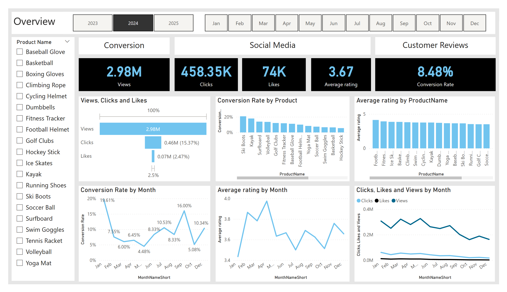

# 📊 Marketing & Sentiment Analysis Dashboard

This project is an end-to-end interactive Power BI dashboard built for a fictional online retailer to analyze customer journey, marketing engagement, and customer sentiment.

## 🛠 Tools & Technologies
- **SQL Server** – data cleaning & transformation
- **Python (NLTK)** – sentiment analysis on customer reviews
- **Power BI** – data visualization & dashboarding

---

## 📌 **Problem Statement**
ShopEasy, an online retailer, faced declining customer engagement and conversion rates despite high marketing expenses.  
The goal of this project was to:
- Analyze drop-offs in the customer journey and improve conversion rates
- Identify which content types drive the highest engagement
- Understand customer sentiment and common themes in product reviews

---

## 🚀 **What I Did**
✅ Cleaned and transformed raw data in SQL (removed duplicates, standardized text, categorized products by price)  
✅ Performed sentiment analysis using NLTK's Vader in Python and categorized reviews  
✅ Built an interactive Power BI dashboard visualizing KPIs, trends, and actionable insights

---

## 📊 **Dashboard Highlights**
- Conversion funnel & drop-off points
- Engagement analysis by content type and month
- Sentiment breakdown & average ratings over time
- Product-wise conversion and engagement metrics

---

## 📁 **Project Structure**
- `/SQL` – SQL scripts used for data cleaning & preparation
- `/Python` – Python script for sentiment analysis
- `/PowerBI` – Exported dashboard (PDF) and screenshot
- `/Data` – Output CSV with sentiment

---

## ✅ **Outcome**
Provided actionable insights to:
- Optimize conversion funnel
- Improve marketing content strategy
- Enhance product features based on customer feedback

---
